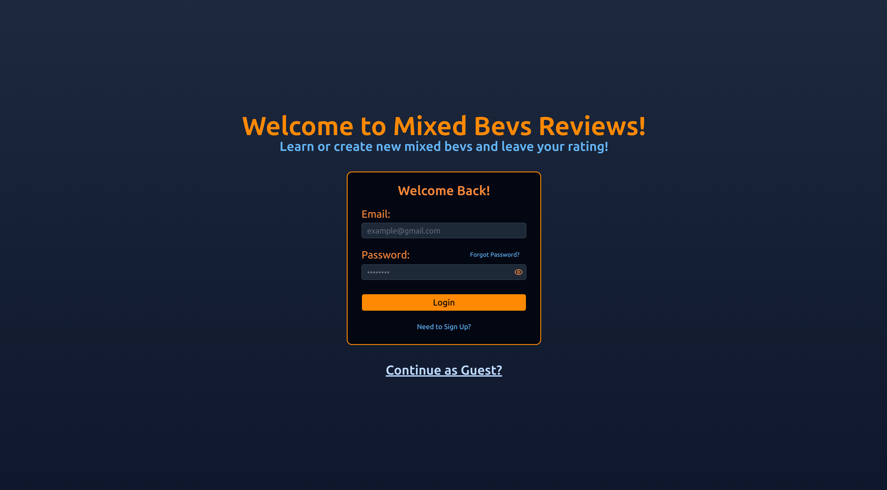

# Mixed Bevs Reviews - Learn, create, and rate mixed drinks

## Frontend:
- NextJS
- Tailwind CSS
- React
- TypeScript

## Backend
- Supabase

# Features
- Users can create and leave a rating on mixed drinks
- Discover and learn how make mixed drinks
- Get a random mixed bev daily

## Live Demo

[View Live Site]()

## Screenshot

## Dataset
- Dataset: Cocktails & Ingredients Dataset
- Author: Filip Kin
- Source: https://www.kaggle.com/datasets/filipkin/cocktails-and-ingredients-dataset
- License: MIT (full text in LICENSE-dataset.txt)
- Note: Original rows collected by the author via the public [TheCocktailDB.com](https://www.thecocktaildb.com/) API